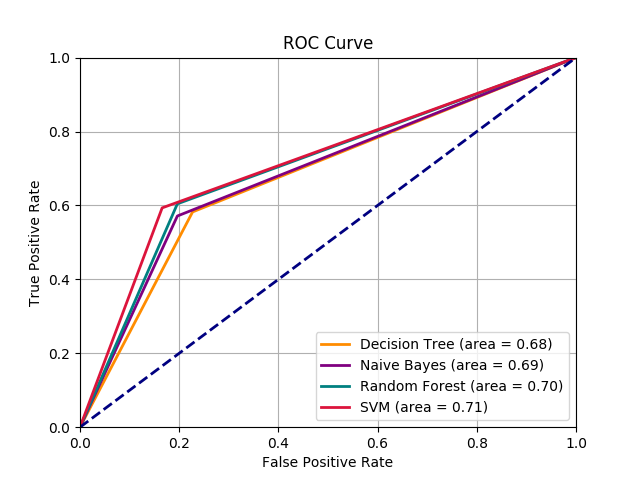

# Classification Algorithms
In machine learning and statistics, classification is a supervised learning approach in which the computer program learns from the data input given to it and then uses this learning to classify new observation.\
This is an example of the use of classification algorithms to build a machine learning model to predict whether the patients in a dataset have diabetes or not.

## Dataset: Pima Indians Diabetes

### Context
The population for this study was the Pima Indian population near Phoenix, Arizona. The population has been under continuous study since 1965 by the National Institute of Diabetes and Digestive and Kidney Diseases because of its high incidence rate of diabetes. Dataset which contains data on female patients at least 21 years old of Pima Indians heritage.

### Data
We have 768 instances and the following 8 attributes:
1. Number of times pregnant (preg)
2. Plasma glucose concentration a 2 hours in an oral glucose tolerance test (plas)
3. Diastolic blood pressure in mm Hg (pres)
4. Triceps skin fold thickness in mm (skin)
5. 2-Hour serum insulin in mu U/ml (insu)
6. Body mass index measured as weight in kg/(height in m)^2 (mass)
7. Diabetes pedigree function (pedi)
8. Age in years (age)

### Observations
- The preg and age attributes are integers.
- The population is generally young, less than 50 years old.
- Missing Attribute Values: None
- 500 negative instances (65.1%)
- 268 positive instances (34.9%)

### Packages
- [pandas](https://pandas.pydata.org/)
- [scikit-learn](http://scikit-learn.org/stable/)
- [matplotlib](https://matplotlib.org/)

### Classifications Algorithms
#### 1. Decision Trees
```python
from sklearn.tree import DecisionTreeClassifier, export_graphviz
```
#### 2. Naive Bayes
```python
from sklearn.naive_bayes import GaussianNB
```
#### 3. Random Forest
```python
from sklearn.ensemble import RandomForestClassifier
```
#### 4. Support Vector Machine
```python
from sklearn.svm import SVC
```

### Procedure

#### 1. Gathering Data
```python
from pandas import read_csv

# Data Import
diabetes_df = read_csv('diabetes.csv', sep=',', header=None)
```

#### 2. Data Preprocessing
```python
# Data preprocessing
# Z-Score Normalization
for each in diabetes_df.columns[:-1]:
  mean, std = diabetes_df[each].mean(), diabetes_df[each].std()
  diabetes_df.loc[:, each] = (diabetes_df[each] - mean)/std
```

#### 3. Classification Algorithms
```python
# Classifiers
# Decision Tree - Criterion: Entropy
decision_tree = DecisionTreeClassifier(criterion="entropy")

# Gaussian Naive-Bayes
gnb = GaussianNB()

# Random Forest - trees: 73
rf_clf = RandomForestClassifier(n_estimators=73)

# SVM
C = 1.0
svc = SVC(kernel="linear", C=C)
```

#### 4. Training
Two approach
##### 4.1 Training and testing sets
```python
from sklearn.model_selection import train_test_split

# Create training and testing sets
# Training Set 77%
# Testing Set 33%
X_train, X_test, y_train, y_test = train_test_split(X, y, test_size=0.33, random_state=100)
n_samples = X_test.shape[0]

decision_tree.fit(X_train, y_train)
y_score_dt = decision_tree.predict(X_test)
# Save graph tree in txt
save_tree_txt(decision_tree, "decision_tree.txt") 

gnb.fit(X_train, y_train)
y_score_nb = gnb.predict(X_test)

rf_clf.fit(X_train, y_train)
y_score_rf = rf_clf.predict(X_test)

svc.fit(X_train, y_train)
y_score_svc = svc.predict(X_test)
```

##### 4.2 [Cross-Validation](http://scikit-learn.org/stable/modules/cross_validation.html)
```python
from sklearn.model_selection import cross_val_score

# Cross-Validation kFOLD:10
scores_dt = cross_val_score(decision_tree, X, y, cv=10)
scores_nb = cross_val_score(gnb, X, y, cv=10)
scores_rf = cross_val_score(rf_clf, X, y, cv=10)
scores_svc = cross_val_score(svc, X, y, cv=10)
```

#### 5. Results
##### 5.1 Training and testing sets
###### 5.1.1 Decision Tree
```
Decision Tree
Condition Negative Rate: 79/254
Confusion Matrix:
[[123  40]
 [ 39  52]]
Accuracy: 68.898%
Error: 31.102%
TPR (Sensitivity): 0.571
FNR: 0.429
TNR (Specificity): 0.755
FPR: 0.245
PPV (Precision): 0.565
Macroaverage: 0.663
```
###### 5.1.2 Naive Bayes
```
Naive Bayes
Condition Negative Rate: 71/254
Confusion Matrix:
[[131  32]
 [ 39  52]]
Accuracy: 72.047%
Error: 27.953%
TPR (Sensitivity): 0.571
FNR: 0.429
TNR (Specificity): 0.804
FPR: 0.196
PPV (Precision): 0.619
Macroaverage: 0.688
```
###### 5.1.3 Random Forest
```
Random Forest
Condition Negative Rate: 71/254
Confusion Matrix:
[[126  37]
 [ 34  57]]
Accuracy: 72.047%
Error: 27.953%
TPR (Sensitivity): 0.626
FNR: 0.374
TNR (Specificity): 0.773
FPR: 0.227
PPV (Precision): 0.606
Macroaverage: 0.700
```
###### 5.1.4 Support Vector Machine
```
SVM
Condition Negative Rate: 64/254
Confusion Matrix:
[[136  27]
 [ 37  54]]
Accuracy: 74.803%
Error: 25.197%
TPR (Sensitivity): 0.593
FNR: 0.407
TNR (Specificity): 0.834
FPR: 0.166
PPV (Precision): 0.667
Macroaverage: 0.714
```

##### 5.2 Cross-Validation
```
Accuracy KFold:10
Decision Tree 68.09% (+/- 0.04)
Naive Bayes 75.65% (+/- 0.03)
Random Forest 76.05% (+/- 0.05)
SVM 77.22% (+/- 0.03)
```

##### 5.3 Decision Tree Graph:
For visualization open ***decision_tree.txt***, then copy and paste [here](http://webgraphviz.com/).

##### 5.4 ROC Curve:


### License
[The MIT License](http://opensource.org/licenses/MIT)
